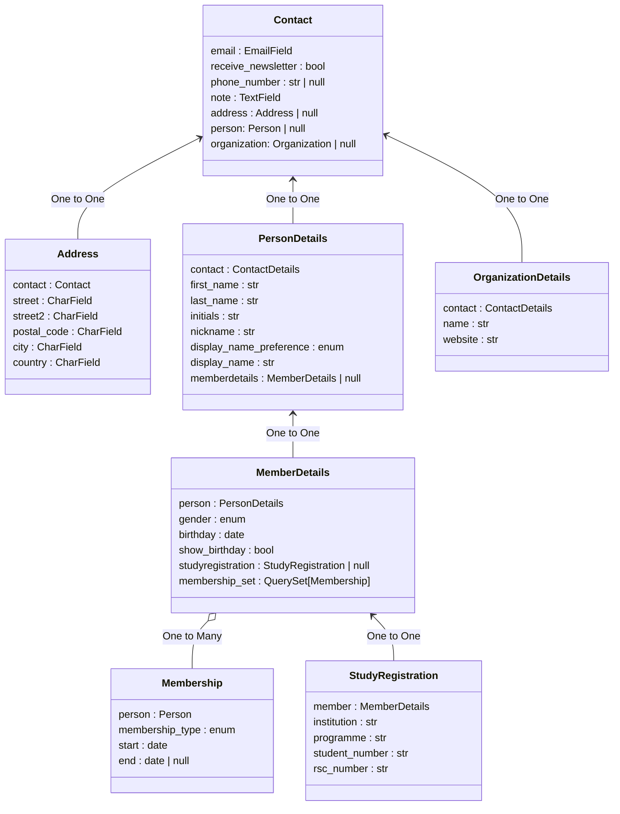

```mermaid
classDiagram

    class Contact {
        email : EmailField
        receive_newsletter : bool
        phone_number : str | null
        note : TextField

        address : Address | null
        person: Person | null
        organization: Organization | null
    }

    class Address {
        contact : Contact

        street : CharField
        street2 : CharField
        postal_code : CharField
        city : CharField
        country : CharField
    }

    class PersonDetails {
        contact : ContactDetails

        first_name : str
        last_name : str
        initials : str
        nickname : str
        display_name_preference : enum
        display_name : str

        memberdetails : MemberDetails | null
    }

    class OrganizationDetails {
        contact : ContactDetails
        name : str
        website : str
    }

    class MemberDetails {
        person : PersonDetails
        gender : enum
        birthday : date
        show_birthday : bool
        studyregistration : StudyRegistration | null
        membership_set : QuerySet[Membership]
    }

    class StudyRegistration {
        member : MemberDetails

        institution : str
        programme : str
        student_number : str
        rsc_number : str
    }

    class Membership {
        person : Person
        membership_type : enum
        start : date
        end : date | null
    }

    Contact <-- Address : One to One
    Contact <-- OrganizationDetails : One to One
    Contact <-- PersonDetails : One to One
    PersonDetails <-- MemberDetails : One to One
    MemberDetails o-- Membership : One to Many
    MemberDetails <-- StudyRegistration : One to One
```
