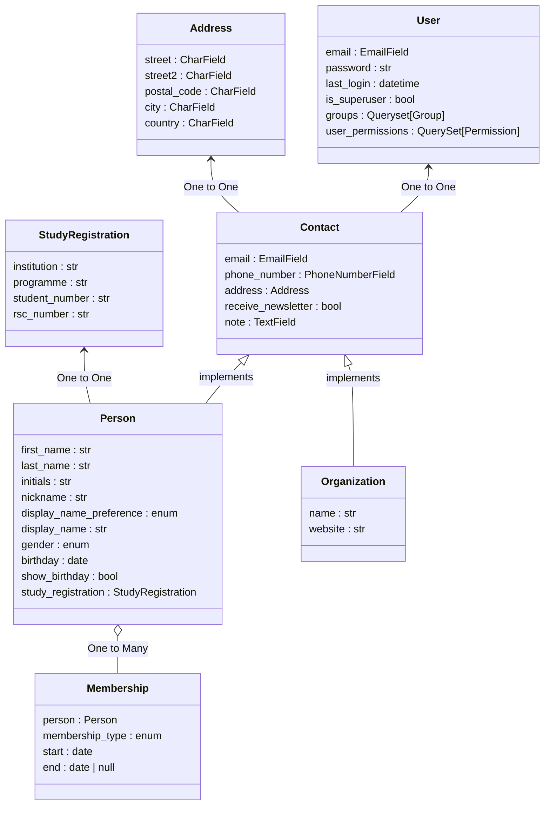

```mermaid
classDiagram

    class User {
        email : EmailField
        password : str
        last_login : datetime
        is_superuser : bool
        groups : Queryset[Group]
        user_permissions : QuerySet[Permission]
    }

    class Address {
        street : CharField
        street2 : CharField
        postal_code : CharField
        city : CharField
        country : CharField
    }

    class StudyRegistration {
        institution : str
        programme : str
        student_number : str
        rsc_number : str
    }

    class Contact {
        email : EmailField
        phone_number : PhoneNumberField
        address : Address
        receive_newsletter : bool
        note : TextField
    }

    class Person {
        first_name : str
        last_name : str
        initials : str
        nickname : str
        display_name_preference : enum
        display_name : str
        gender : enum
        birthday : date
        show_birthday : bool
        study_registration : StudyRegistration
    }

    class Organization {
        name : str
        website : str
    }

    class Membership {
        person : Person
        membership_type : enum
        start : date
        end : date | null
    }

    Address <-- Contact : One to One
    User <-- Contact : One to One
    StudyRegistration <-- Person : One to One
    Contact <|-- Person : implements
    Contact <|-- Organization : implements
    Person o-- Membership : One to Many
```
