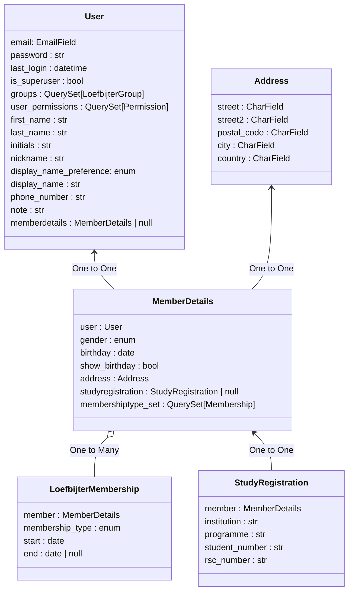

```mermaid
classDiagram

    class User {
        email: EmailField
        password : str
        last_login : datetime
        is_superuser : bool
        groups : QuerySet[LoefbijterGroup]
        user_permissions : QuerySet[Permission]
        first_name : str
        last_name : str
        initials : str
        nickname : str
        display_name_preference: enum
        display_name : str
        phone_number : str
        note : str
        memberdetails : MemberDetails | null
    }

    class MemberDetails {
        user : User
        gender : enum
        birthday : date
        show_birthday : bool
        address : Address
        studyregistration : StudyRegistration | null
        membershiptype_set : QuerySet[Membership]
    }

    class Address {
        street : CharField
        street2 : CharField
        postal_code : CharField
        city : CharField
        country : CharField
    }

    class StudyRegistration {
        member : MemberDetails

        institution : str
        programme : str
        student_number : str
        rsc_number : str
    }

    class LoefbijterMembership {
        member : MemberDetails
        membership_type : enum
        start : date
        end : date | null
    }

    User <-- MemberDetails : One to One
    Address <-- MemberDetails : One to One
    MemberDetails o-- LoefbijterMembership : One to Many
    MemberDetails <-- StudyRegistration : One to One
```
